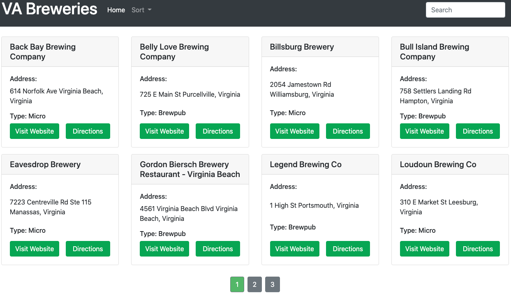

# VA Breweries

## Link

[VA Breweries Online](https://va-breweries.vercel.app/)

## Description

VA Breweries is a directory of breweries, cideries, and craft beer bottle shops located in Virginia. This project was designed to help users to more easily access pertinent information on Virginia's breweries.

## Getting Started

1. The user is directed to a page of 8 brewery listings
2. Additional breweries can be viewed using the pagination buttons located on the bottom of the page
3. Users can sort the listings alphabetically by brewery name, location, or type using the **Sort** dropdown menu located in the header
4. Additionally, users can filter their search using the search bar

## Features

- Each brewery listing includes a "Visit Website" and "Directions" links to get more information and view Google Maps, respectively
- When using the sort feature, the listings will remain sorted even when filtering out listings using the search bar

## Technology

- Built using Bootstrap to create the layout, styling, and responsive design
- Implemented Axios to send HTTP requests to the Open Brewery Database
- Used DOM manipulation to customize event listeners and rendering

## API Documentation

[Open Brewery DB Documentation](https://www.openbrewerydb.org/documentation/01-listbreweries)

## Future Goals

- Implement a Virginia Map feature to interact with all Virginia breweries
- Include photos of brewery store fronts
